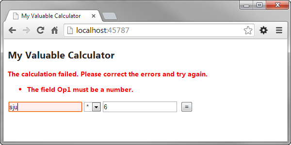

0. Introduktionsuppgift
=======================

[0-introduktionsuppgift.pdf](https://github.com/1dv409/kursmaterial/blob/master/Laborationsuppgifter/0-introduktionsuppgift.pdf)

"Du ska följa ”steg-för-steg”-instruktionen i denna introduktionsuppgift och skapa en ASP-NET MVC-applikation som ska addera två heltal en användare matar in i två textfält. Du kommer därefter att modifiera applikationen så att användaren kan välja vilket räknesätt som ska användas."
